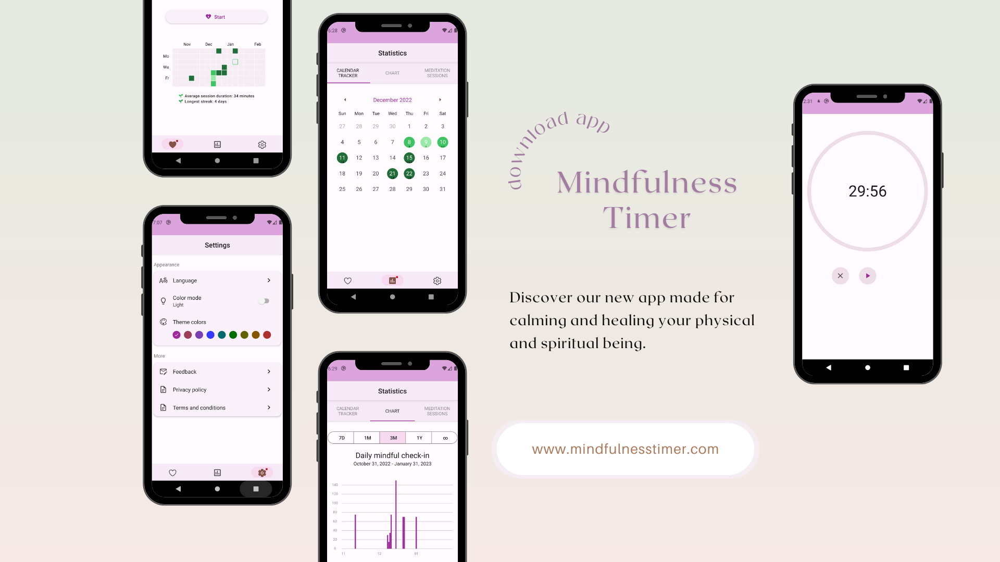

# The Mindfulness Timer

**The Mindfulness Timer** app is designed to support your mindfulness meditation practice and help you build a more mindful lifestyle. With accurate timing and mindfulness reminder bells, the app helps you stay focused and present.

## Preview

 

## Setup
1. Clone the project to your local machine.
2. Run yarn or npm install to install the dependencies.

## Contributing

If you want to contribute to this project, please follow these steps:

1. Fork the repository.
2. Create a new branch.
3. Make your changes.
4. Push your changes to your fork.
5. Submit a pull request.
